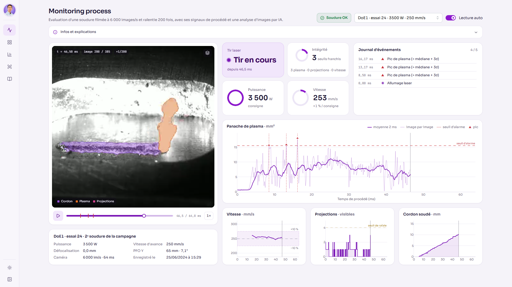

# Laser Welding Process Monitor

Monitoring de production d'un procédé de soudage laser, construit sur 81 soudures réelles filmées en caméra
ultra-rapide. Le projet a **deux volets distincts** :

1. **Un modèle d'IA et sa chaîne de mesure, exécutés hors ligne** (`pipeline/`, GPU). Un U-Net de segmentation
   est entraîné sur les vidéos annotées, puis **appliqué à chacune des 59 830 images des 81 vidéos**. Ses masques
   (cordon, plasma, projections) sont convertis en mesures physiques, en signaux de procédé, en alarmes et en
   verdict qualité par soudure.
2. **Un dashboard de restitution léger, conçu pour la démonstration** (`src/`, image Docker sans torch). Il
   présente ces résultats comme un poste de monitoring de production : suivi qualité, relecture image par image
   avec les masques et les courbes, analyses statistiques. Il ne fait tourner aucun modèle : il lit les sorties
   de l'inférence, calculées une fois pour toutes.



*Onglet Monitoring process : relecture de la soudure DoE1 essai 24 avec les masques IA (cordon, plasma, projections), l'état du tir, les alarmes et les signaux mesurés à l'image.*

> Projet personnel de [Lenny Jacquinot](https://www.linkedin.com/in/lenny-jacquinot-ai-engineer/), IA & Data pour l'industrie.

Ce document est le point d'entrée pour reprendre le projet. Les détails sont dans [`docs/`](docs/) :

| Document | Contenu |
|---|---|
| [docs/donnees.md](docs/donnees.md) | Dictionnaire des données : chaque fichier produit, ses colonnes, ses unités, sa provenance |
| [docs/modele.md](docs/modele.md) | Fiche du modèle de segmentation : données, entraînement, évaluation, rechargement, réentraînement |
| [docs/application.md](docs/application.md) | Architecture de l'application Dash, flux de données, contrats entre Python et JavaScript |
| [docs/production.md](docs/production.md) | Temps d'inférence, architecture de production, dimensionnement |
| [docs/exploitation.md](docs/exploitation.md) | Image Docker, déploiement, sécurité, configuration, maintenance |

## Sommaire

1. [Périmètre](#1-périmètre)
2. [Démarrage rapide](#2-démarrage-rapide)
3. [Prérequis](#3-prérequis)
4. [Organisation du dépôt](#4-organisation-du-dépôt)
5. [Données](#5-données)
6. [Pipeline de traitement](#6-pipeline-de-traitement)
7. [Modèle de segmentation](#7-modèle-de-segmentation)
8. [Performances et passage en production](#8-performances-et-passage-en-production)
9. [Signaux, alarmes et verdict qualité](#9-signaux-alarmes-et-verdict-qualité)
10. [Application](#10-application)
11. [Qualité : tests, lint, CI](#11-qualité--tests-lint-ci)
12. [Licence et attribution](#13-licence-et-attribution)

## 1. Périmètre

### Volet 1 : modèle et chaîne de mesure (hors ligne)

- **Entraînement** d'un U-Net (encodeur ResNet34) sur 8 vidéos annotées, avec un découpage par vidéo et une
  évaluation sur 2 vidéos jamais vues, comparée à une baseline de vision classique.
- **Inférence sur la totalité des données** : chaque frame des 81 vidéos est segmentée (étape `06_infer`).
  Les vidéos avec masques incrustés affichées par le dashboard sont la sortie brute du modèle, image par image.
- **Mesures dérivées des masques** : aire et hauteur du panache de plasma, nombre de projections, longueur et
  largeur du cordon, vitesse d'avance réelle (suivi du front du cordon), avec un étalonnage pixels / mm par série.
- **Qualification** : alarmes (pics de plasma, rafales de projections, écarts de vitesse), verdict OK / OK avec
  warning / NOK par soudure, et modèles de surface de réponse reliant les paramètres procédé aux indicateurs.

L'ensemble se reconstruit avec `make pipeline` (environ 45 min sur RTX 3090).

### Volet 2 : dashboard de restitution (en ligne)

Le dashboard rejoue la campagne comme une ligne de production : verdict de chaque soudure, relecture ralentie
environ 200 fois avec les courbes synchronisées, comparaison annotation / prédiction, analyses du plan
d'expériences.

**Le dashboard n'a pas vocation à solliciter une inférence du modèle** : c'est un rendu léger de démonstration.
L'image n'embarque que les résultats ce qui lui permet de rester légère. La réponse est immédiate, le coût 
d'hébergement quasi nul et la surface d'attaque minimale. Tout ce que le dashboard affiche
(masques, courbes, alarmes, verdicts) provient du modèle.

### Architecture sur une vraie ligne de production ?

L'architecture du code correspond déjà à celui d'un déploiement réel : une brique d'inférence au pied de la machine
et une brique de restitution, le dashboard. Les performances mesurées permettent d'envisager un **contrôle à chaque
soudure**, en environ 3 s de calcul par contrôle sur un GPU (voir [section 8](#8-performances-et-passage-en-production) 
et [docs/production.md](docs/production.md)).

**Résultats principaux**

| Indicateur | Valeur |
|---|---|
| IoU cordon / plasma (2 vidéos jamais vues) | 0,93 / 0,69 |
| F1 de détection des projections | 0,72 (baseline vision classique : 0,04) |
| Écart vitesse mesurée / consigne | moyenne proche de 0 %, σ ≈ 3,7 % |
| R² du modèle de largeur de cordon | 0,81 |

## 2. Démarrage rapide

Trois situations selon ce dont on dispose.

**A. Les artefacts `app_data/` sont déjà présents** (machine de développement, copie d'une livraison) :

```bash
uv sync                   # dépendances de l'app seule
make app                  # http://127.0.0.1:8050
```

**B. Reconstruction complète depuis les données brutes** (machine avec GPU CUDA) :

```bash
# 1. Télécharger les données source https://doi.org/10.5281/zenodo.22282527 dans data/ 
# 2. Installer et dérouler le pipeline
uv sync --all-groups      # app + pipeline
make pipeline             # environ 45 min sur RTX 3090
make app
```

**C. Image Docker** (démonstration ou mise en ligne, sans Python local) :

```bash
make docker               # nécessite app_data/, copié dans l'image
make docker-run           # http://127.0.0.1:8050
```

`make help` liste toutes les cibles.

## 3. Prérequis

| Outil | Version | Utilisé pour |
|---|---|---|
| Python | 3.12 (fixé par `.python-version`) | tout |
| [uv](https://docs.astral.sh/uv/) | 0.11 ou plus | environnements et dépendances (`uv.lock`) |
| ffmpeg et ffprobe | 6.x testé | transcodage vidéo, non installé par uv |
| GPU NVIDIA + CUDA | testé sur RTX 3090 24 Go | entraînement et inférence |
| Docker | 24 ou plus | image de production, scan Trivy |

Espace disque pour la reconstruction complète : environ **25 Go** (11,4 Go d'archives Zenodo, 12 Go une fois
décompressées, le reste en artefacts). L'app seule n'a besoin que de `app_data/` (environ 160 Mo).

Les dépendances Python sont réparties en groupes :

| Groupe | Contenu | Installé par |
|---|---|---|
| (principal) | Dash, Mantine, gunicorn, Pillow : le runtime de l'app | toujours, seul dans l'image Docker |
| `analysis` | numpy, pandas, scipy, OpenCV, pyarrow | CI, étapes du pipeline sans GPU |
| `ml` | torch, torchvision, segmentation-models-pytorch, timm | entraînement et inférence |
| `pipeline` | `analysis` + `ml` | `make` (cibles du pipeline) |
| `dev` | pytest, ruff | par défaut en local |

## 4. Organisation du dépôt

```
.
├── pipeline/                 traitements hors ligne, numérotés dans l'ordre d'exécution
│   ├── common.py             chemins, découpage train / eval, classes, constantes partagées
│   ├── 01_extract.py ... 09_export.py
│   ├── segmodel.py           architecture du U-Net, prétraitement, post-traitement
│   ├── metrics.py            IoU par classe, appariement des projections
│   ├── baseline_cv.py        baseline sans apprentissage (seuillage), pour comparaison
│   └── bench_infer.py        mesure des temps d'inférence (make bench)
├── src/weldmon/app/          application Dash (seul code embarqué dans l'image)
│   ├── __init__.py           create_app() : coque, navigation, thème
│   ├── main.py               point d'entrée (local et gunicorn)
│   ├── data.py               lecture seule des artefacts, liste blanche des runs
│   ├── security.py           en-têtes HTTP, routes /media, /overlay, /healthz
│   ├── components.py         composants partagés (en-têtes de section, badges, icônes)
│   ├── theme.py              jetons de couleur clair / sombre, mise en page Plotly commune
│   ├── tabs/                 un module par onglet
│   └── assets/               CSS, logique client (*.js), polices, icônes, photo
├── tests/                    tests unitaires (signaux, métriques) et HTTP (app)
├── docs/                     documentation détaillée
├── deploy/Caddyfile          reverse proxy TLS
├── Dockerfile, compose.yaml, gunicorn.conf.py
├── Makefile                  orchestration (pipeline, app, tests, image)
└── pyproject.toml, uv.lock   dépendances figées
```

Non versionnés (voir `.gitignore`) : `data/` (brut et intermédiaires), `models/` (poids du U-Net) et
`app_data/` (artefacts de l'app). Ils se régénèrent avec le pipeline.

## 5. Données

**Source** : *High-Speed Laser Beam Welding Video Dataset with Weld, Plasma, and Spatter Annotations*,
University of Skövde, 2026, DOI [10.5281/zenodo.22282527](https://doi.org/10.5281/zenodo.22282527), licence
CC BY-NC 4.0. 

Trois fichiers à placer dans `data/` sans les renommer :

| Fichier | Taille | Contenu |
|---|---|---|
| `high_speed_camera_videos.zip` | 10 Go | 81 vidéos AVI Photron 1024 × 1024, 6 000 à 9 000 im/s, et leurs métadonnées `.cihx` |
| `Labels.zip` | 1,4 Go | annotations SAM2 de 8 vidéos DoE3 (164 frames chacune) : 6 d'entraînement, 2 d'évaluation |
| `Laser_Welding_Dataset_Metadata.xlsx` | 15 ko | plan Box-Behnken des 3 séries et ordre d'exécution |

**Filiation des données** : chaque niveau est produit par le précédent, jamais modifié à la main.

| Niveau | Dossier | Taille | Rôle |
|---|---|---|---|
| Brut | `data/*.zip`, `data/*.xlsx` | 11,4 Go | dataset Zenodo, tel que téléchargé |
| Intermédiaire | `data/interim/` | 12 Go | contenu exact des deux archives, décompressé (aucune transformation) |
| Traité | `data/processed/` | 190 Mo | tables des runs, labels normalisés, mesures par frame, signaux, KPI, modèles DoE |
| Modèle | `models/` | 190 Mo | poids du U-Net, historique d'entraînement, métriques d'évaluation |
| Application | `app_data/` | 160 Mo | artefacts légers en JSON, vidéos web, images ; seul niveau embarqué dans l'image |

Le détail de chaque fichier (colonnes, unités, script producteur) est dans [docs/donnees.md](docs/donnees.md).

## 6. Pipeline de traitement

Chaque étape est un script autonome de `pipeline/`, lancé depuis ce dossier (`make` s'en charge). Elles
s'enchaînent dans l'ordre des numéros ; chacune lit les sorties des précédentes.

| Étape | Objectif | Cible `make` | Entrées | Sorties |
|---|---|---|---|---|
| `01_extract` | Décompresser les archives Zenodo, sans aucune transformation | `data` | archives Zenodo | `data/interim/` |
| `02_metadata` | Construire la table des 81 soudures : paramètres du plan d'expériences, ordre de soudage, métadonnées caméra (cadence, nombre d'images, horodatage) | `data` | xlsx, `.cihx` | `processed/runs.parquet` |
| `03_transcode` | Convertir les vidéos caméra en vidéos web légères (512 px, une image caméra par image vidéo) et extraire une image d'attente par vidéo | `data` | AVI | `app_data/media/videos/<run>.mp4`, `posters/<run>.jpg` |
| `04_labels` | Transformer les annotations SAM2 des 8 vidéos annotées en une carte de classes par image (fond, cordon, plasma, projections), recalée et vérifiée sur la vidéo | `labels` | annotations SAM2, AVI | `processed/labels/<run>/{frames,masks}`, `labeled_frames.parquet`, `label_instances.parquet` |
| `05_train_seg` | Entraîner le U-Net, l'évaluer sur 2 vidéos jamais vues et le comparer à une baseline sans apprentissage (GPU, environ 15 min) | `train` | labels | `models/unet.pt`, `history.csv`, `metrics.json` |
| `06_infer` | Segmenter chacune des images des 81 vidéos, en tirer les mesures brutes par image (plasma, projections, cordon) et produire les vidéos avec masques (GPU, environ 10 min) | `infer` | AVI, `unet.pt` | `processed/frame_features.parquet`, `processed/preds/`, `app_data/media/videos/<run>_ia.mp4` |
| `07_signals` | Étalonner pixels / mm, construire les signaux de procédé (vitesse, plasma, projections, cordon), détecter allumage, extinction et alarmes, calculer les indicateurs de chaque soudure | `features` | mesures par image | `processed/ts/<run>.json`, `run_kpis.parquet`, `calibration.json` |
| `08_doe` | Ajuster les modèles de surface de réponse reliant les paramètres procédé aux indicateurs | `features` | runs + indicateurs | `processed/doe.json` |
| `09_export` | Décider le verdict de chaque soudure, calculer les limites de vigilance et exporter les fichiers légers lus par l'app | `export` | tout ce qui précède | `app_data/` (JSON, images de comparaison) |

**Relancer une partie du pipeline** : après une modification, relancer l'étape modifiée et toutes les
suivantes. 

## 7. Modèle de segmentation

U-Net à encodeur ResNet34 (24,4 M de paramètres), entrée en niveaux de gris 512 × 512, 4 classes : fond,
cordon, plasma, projections. Découpage **par vidéo**, jamais par frame, pour éviter les fuites entre images
voisines :

| Rôle | Vidéos |
|---|---|
| Entraînement | DoE3_9, DoE3_22, DoE3_24, DoE3_25, DoE3_26 |
| Validation (choix du checkpoint) | DoE3_16 |
| Évaluation finale (jamais vues) | DoE3_19, DoE3_23 |

Un post-traitement à l'échelle de la vidéo (`segmodel.suppress_static`) supprime les détections immobiles
(reflets, rayures, texture prise pour un cordon). Il fait partie intégrante du modèle : sans lui, la précision
sur les projections tombe de 0,72 à 0,42.

Les poids (`models/unet.pt`, 98 Mo) ne sont ni versionnés ni embarqués dans l'image.

Rechargement, réentraînement et ajout d'annotations : [docs/modele.md](docs/modele.md).

## 8. Performances et passage en production

Temps mesurés sur RTX 3090, pour une soudure type de 700 images (reproductibles avec `make bench`) :

| Poste | Temps par soudure | Débit |
|---|---|---|
| U-Net seul | 2,3 s | 300 im/s (407 im/s en passe avant pure, lots de 32, fp16) |
| Chaîne de mesure complète (modèle, post-traitement, mesures) | environ 3 s | |
| Mémoire GPU | 3,3 Go | |

Ces temps permettent d'envisager un contrôle à chaque soudure, en environ 3 s par contrôle, avec un GPU de
gamme courante.

[docs/production.md](docs/production.md) détaille les mesures, propose une architecture de production (déclenchement,
acquisition, inférence au pied de la machine, décision vers l'automate, stockage, supervision, suivi du modèle),
la dimensionne et liste les optimisations et les points à valider avant un pilote, à commencer par le lien entre
le verdict et la qualité réelle des soudures.

## 9. Signaux, alarmes et verdict qualité

Construits par `07_signals.py` à partir des mesures par frame, puis qualifiés par `09_export.py`.

- **Étalonnage pixels / mm** : un facteur par série (le cadrage change), estimé comme la médiane du rapport
  vitesse de consigne / vitesse du front du cordon en px/s. Les écarts de chaque run à la consigne restent
  donc de vraies mesures.
- **Allumage et extinction du laser** : détectés à l'image (présence du plasma sur une fenêtre glissante,
  extinction bornée par l'arrivée du front du cordon).
- **Alarmes** : pic de plasma au-delà de médiane + 3σ robuste, rafale de projections (au moins 4 visibles
  simultanément), écart de vitesse de plus de 20 % pendant au moins 5 ms.
- **Verdict** : OK jusqu'à 10 alarmes (pics + rafales), OK avec warning jusqu'à 15, NOK au-delà ou dès qu'une
  alarme de vitesse est levée.

**Paramètres réglables**

| Paramètre | Fichier | Valeur | Effet |
|---|---|---|---|
| `SPIKE_SIGMA` | `07_signals.py` | 3,0 | seuil de pic de plasma (en σ robustes au-dessus de la médiane du run) |
| quantile de rafale | `07_signals.py` (`main`) | 99 % | seuil de rafale : quantile du nombre de projections visibles, laser allumé, 81 runs (minimum 3) |
| `SPEED_TOL` / `SPEED_ALARM_MS` | `07_signals.py` | 20 % / 5 ms | alarme d'écart de vitesse |
| `ALARM_MERGE_MS` | `07_signals.py` | 1 ms | deux alarmes de même type plus proches sont fusionnées |
| `VERDICT_OK_MAX` / `VERDICT_WARN_MAX` | `09_export.py` | 10 / 15 | bornes du verdict |
| `SPEED_WARN_PCT` | `09_export.py` | 10 % | zone de vigilance (dorée) sur la vitesse |
| `STABILITY_QUANTILE` | `09_export.py` | 90 % | limite d'instabilité du plasma : quantile du CV glissant sur les 81 runs |

Le seuil de rafale et la limite d'instabilité sont calculés sur les données. Après un réentraînement, ils
peuvent légèrement bouger, et avec eux le verdict des soudures proches d'une limite.

## 10. Application

Principe : **tout est précalculé**. L'inférence du modèle a lieu dans le pipeline (étape `06_infer`), pas dans
l'app (voir [Périmètre](#volet-2--dashboard-de-restitution-en-ligne)). Le serveur ne sert que la mise en page et
des fichiers statiques. La relecture tourne dans le navigateur (callbacks clientside qui lisent
`video.currentTime`), sans aller-retour serveur pendant la lecture. Conséquences : charge serveur quasi nulle,
image légère, surface d'attaque minimale.

| Onglet | Ancre | Module | Contenu |
|---|---|---|---|
| Monitoring process | `#process` | `tabs/process.py` + `assets/process.js` | relecture d'une soudure, cartes tir laser / intégrité / puissance / vitesse, journal, courbes |
| Suivi & historique | `#suivi` | `tabs/history.py` + `assets/history.js` | verdict des 81 soudures, filtres, courbe des alarmes, ouverture dans le monitoring |
| Analyses | `#analyses` | `tabs/doe.py` | surfaces de réponse, effets standardisés, effets principaux, carte I-MR des résidus |
| Segmentation IA | `#seg` | `tabs/segmentation.py` + `assets/seg.js` | annotation humaine contre prédiction, carte des désaccords, métriques |
| Méthode | `#about` | `tabs/about.py` | chaîne de traitement, statut de chaque signal, licence |

Contrainte de mise en page : chaque page tient sans défilement en plein écran 1920 × 1080.

Architecture détaillée, conventions et procédure d'ajout d'un onglet : [docs/application.md](docs/application.md).

## 11. Qualité : tests, lint, CI

```bash
make test                 # pytest
make lint                 # ruff check + ruff format --check
make scan                 # Trivy sur l'image + pip-audit des dépendances runtime
```

- `tests/test_signals.py` : détection allumage / extinction, pente du front, regroupement d'événements,
  métriques de segmentation. Données synthétiques, toujours exécutés.
- `tests/test_app.py` : en-têtes de sécurité, routes média et Range, liste blanche, cohérence des verdicts,
  rendu des onglets. **Sautés automatiquement si `app_data/` est absent** (cas de la CI).
- CI GitHub (`.github/workflows/ci.yml`) : lint, tests, audit des dépendances runtime, sans GPU ni données.

## 12. Licence et attribution

- **Données** : dataset de A. Darwish, M. Persson, A. Andersson Lassila, D. Lönn, S. Ericson, K. Salomonsson
  (University of Skövde), [CC BY-NC 4.0](https://creativecommons.org/licenses/by-nc/4.0/) : usage non commercial,
  attribution obligatoire. Tout ce qui est dérivé du dataset (vidéos transcodées, masques, poids du modèle,
  `app_data/`, image Docker) hérite de cette licence.
- **Code** : propriétaire, aucune licence open source accordée à ce stade.
- **Polices et icônes** : Sora, JetBrains Mono (SIL OFL) et Lucide (ISC), licences dans `src/weldmon/app/assets/`.